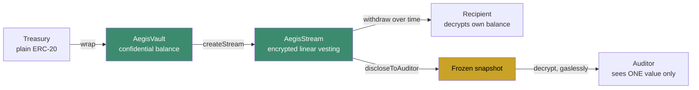
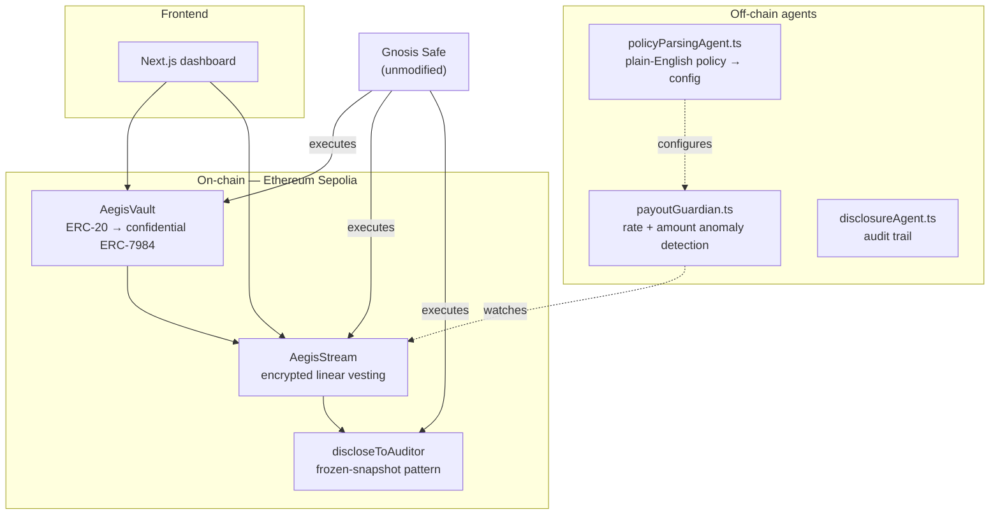
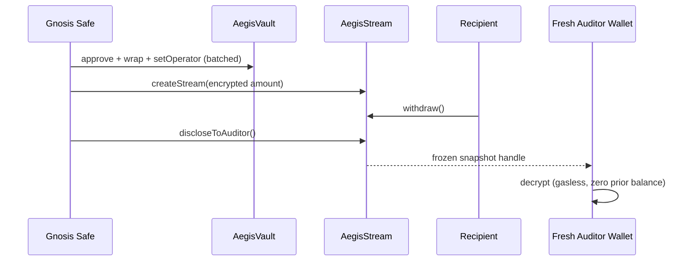

# Aegis

**Confidential payment streams for DAOs and companies, controlled by an unmodified Gnosis Safe.**

Aegis lets an organization pay contributors — salaries, grants, bounties — through a linear payment stream where the *amount* is confidential on-chain, while the stream's existence, timing, and every disclosure event remain fully public and auditable. Money is private; the logic that moves it is not.

**Live app:** [aegis-ten-kappa.vercel.app](https://aegis-ten-kappa.vercel.app/)
**Network:** Ethereum Sepolia — contracts verified on Etherscan, Blockscout, and Sourcify

---

## The problem

Public blockchains expose every payment amount, forever, to anyone. For an
organization paying salaries, grants, or bounties on-chain, that's a
dealbreaker: it leaks compensation data, invites front-running on treasury
movements, and blocks institutional adoption of crypto-native payroll
entirely.

Existing privacy tools typically hide a single, one-time transfer. Aegis
solves a harder problem: privacy for an **ongoing, time-based payment** —
while keeping every other aspect of the transaction fully transparent.

## What Aegis does



| Layer | Visibility |
|---|---|
| That a stream exists, sender, recipient, timing | **Always public** |
| The payment amount | **Always private** |
| A specific historical value, shown to a specific party | **Disclosable on demand** — a frozen snapshot, never an ongoing view |

Crucially, Aegis is **controlled by a real, unmodified Gnosis Safe**, not a
custom module or a single externally-owned account acting as a stand-in for
"the organization." Every transaction in the [Live Proof](#live-proof)
section below was executed by an actual Safe multisig — proving the
integration works without modifying Safe's own contracts at all.

---

## Architecture



| Component | Purpose |
|---|---|
| **AegisVault** | Wraps a treasury's ERC-20 into a confidential ERC-7984 token (`ERC20ToERC7984Wrapper`, from iExec's Nox protocol). One-step wrap; two-step (encrypt → decrypt-proof) unwrap. |
| **AegisStream** | Linear vesting stream computed with Nox's encrypted arithmetic (`Nox.mul` / `Nox.div` on `euint256`). See [Design note](#design-note-why-reimplement-instead-of-wrap) below. |
| **discloseToAuditor** | Grants an auditor a **frozen, one-time snapshot** of a value — never ongoing access. Since Nox's access-control model has no revoke function, time-boxed disclosure works by minting an independently-permissioned copy of the value at the moment of disclosure. |
| **Off-chain agents** | `payoutGuardian.ts` (rate/amount anomaly detection), `disclosureAgent.ts` (audit trail), `policyParsingAgent.ts` (plain-English policy → structured config, human-reviewed before use). |
| **Frontend** | Full dashboard — wrap, create/view streams, withdraw, disclose. |

### Design note: why reimplement instead of wrap

A natural approach to adding privacy to an existing protocol is to leave it
untouched and route encrypted values through it. We evaluated this against
Sablier, a widely-used streaming-payments protocol, and found it structurally
impossible: Sablier's contracts store deposited/withdrawn amounts as public
`uint128` fields, and its functions accept only plaintext arguments — there
is no path for an encrypted handle to enter a contract built entirely around
public accounting.

Aegis instead reimplements the *linear-vesting pattern* natively with Nox's
encrypted primitives, while leaving the actual treasury and access-control
layer — Gnosis Safe — completely unmodified. This distinction matters:
protocols whose sensitive data is a *value in transit* (a transfer, a swap)
can be wrapped; protocols whose core function is public accounting have to
be rebuilt confidentially instead. Full detail in [`feedback.md`](./feedback.md).

---

## Live Proof

Every step below is a real Ethereum Sepolia transaction — not a script that
only runs locally. Click any hash to verify it independently.



### Deployed & verified contracts

| Contract | Address |
|---|---|
| MockERC20 (Aegis Mock USDC) | [`0x8c54d36d...`](https://sepolia.etherscan.io/address/0x8c54d36d022ba2c9684c2c77e48d3d961b6ef507#code) |
| AegisVault | [`0xb9dC5Aeb...`](https://sepolia.etherscan.io/address/0xb9dc5aebe33f7b1f74971c0f87164ed018f69c66#code) |
| AegisStream | [`0xd4AC9ef4...`](https://sepolia.etherscan.io/address/0xd4ac9ef480a60215b0ade26c85716a0b5a87ecf1#code) |
| Demo Gnosis Safe (1-of-1) | [`0x1c0780fa...`](https://sepolia.etherscan.io/address/0x1c0780facd4e295439c07fd69104f276de80dfb4) |

All three contracts are verified on **Etherscan, Blockscout, and Sourcify**.
Nox `NoxCompute` on Ethereum Sepolia: `0x24Ef36Ec5b626D7DCD09a98F3083c2758F0F77bF`

### The full journey

| Step | What happened | Transaction |
|---|---|---|
| 1. Safe wraps treasury funds | Batched `approve` + `wrap` + `setOperator` — one Safe-executed transaction | [`0x4b177d82...`](https://sepolia.etherscan.io/tx/0x4b177d82952c3c40a7b6a3f42db7ae911a7d127f1e590b9421610eeacf511b31) |
| 2. Safe creates a confidential stream | Amount encrypted client-side; Nox proof correctly attributed to the Safe as owner; `createStream()` called directly by the Safe | [`0xab3627e9...`](https://sepolia.etherscan.io/tx/0xab3627e9b56daf8bd283c641be88bd93449af5fca164c046889ff43d813517ea) |
| 3. Recipient withdraws | Recipient claims their vested portion — amount stays encrypted on-chain throughout | [`0x891aba69...`](https://sepolia.etherscan.io/tx/0x891aba69fb84865c1e45ffb1aed5a4096f9bf9d872e1ea525b7276eb36476a36) |
| 4. Safe discloses to an auditor | Safe grants a freshly generated, zero-balance wallet a frozen snapshot of the withdrawn amount | [`0x892d9d01...`](https://sepolia.etherscan.io/tx/0x892d9d01f741926999f65ea16be7afec83497dcb7ff45db7e9eb286ad8f71e14) |
| 5. Auditor decrypts, gaslessly | The auditor wallet — which never held ETH — decrypts the disclosed value via a signed, gasless request | — |

**What each step proves:**
- **Steps 1–2** — genuine multisig compatibility, not a single-EOA stand-in.
- **Step 2** — the encryption layer correctly attributes proofs to
  smart-contract-wallet senders, not just externally-owned accounts (see
  `feedback.md` §6 for the underlying investigation).
- **Step 3** — the vesting math is encrypted end-to-end, not simulated.
- **Steps 4–5** — selective disclosure works exactly as designed: a party
  with zero prior relationship to the system can be granted narrow,
  auditable access to one historical value — nothing more.

---

## Also applicable to bounties and grants

A one-time bounty or grant payout is a stream with a shorter duration — no
additional contracts required. The same wrap → stream → disclose flow
applies identically whether the recipient is a salaried contributor or a
one-time grant winner.

---

## Governance compatibility

Aegis is designed to sit behind a Gnosis Safe rather than a single EOA.
`AegisStream`'s `sender` field can be a Safe's contract address directly —
Safe's own signer-approval process governs who can trigger `createStream()`
or `discloseToAuditor()` from it, with zero additional integration required
on Aegis's side. This is proven live above, not merely asserted. A dedicated
Safe module for richer proposal/voting UX around stream creation is a
natural extension, outside the current scope.

---

## Getting started

**Contracts** (in `/aegis`):
```bash
cd aegis
npm install
npx hardhat test
```
Requires Node.js 22+ and Docker running locally (for the Nox offchain stack
used during testing).

**Frontend** (in `/frontend`):
```bash
cd frontend
npm install
npm run dev
```

## Deployment target

Ethereum Sepolia. See [`feedback.md`](./feedback.md) for notes on confirming
Nox network support before targeting a new chain.

## Acknowledgments

Confidential token design built on iExec's Nox protocol
(`@iexec-nox/nox-confidential-contracts`). The streaming model is inspired by
Sablier's LockupLinear mechanics (referenced for design purposes only — no
code reused; see `feedback.md` for why direct wrapping was not viable).

See [`feedback.md`](./feedback.md) for a full account of the technical
challenges encountered while integrating with Nox, and how each was
resolved.

